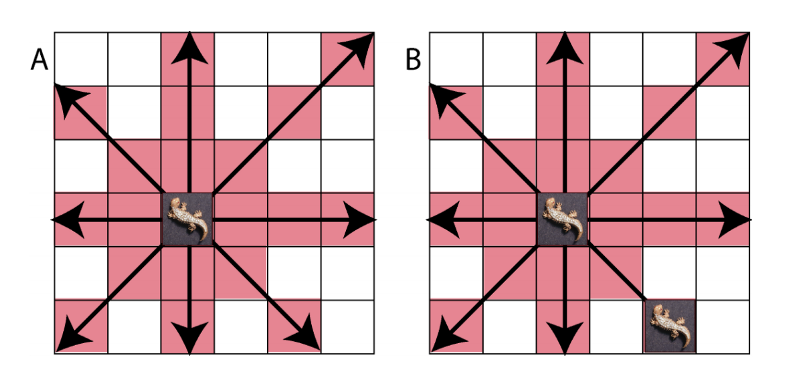
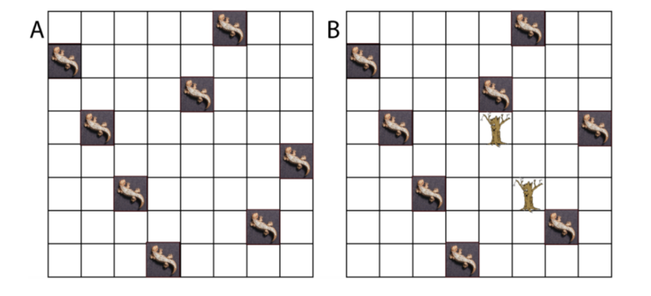

# N-Queens Variation
A search implementation program to solve a variation of the classical n-Queens problem with obstacles, using BFS, DFS, and simulated annealing methods.

## Description
In this variation, we imagine that there is a nursery that is an M x N grid (instead of a chessboard), with lizards (instead of queens) as objects on the grid. Like the queens, the lizards can attack each other in any direction: longitudinally, laterally, and diagonally. The variation is that there are trees on this grid, that can block the line of sight of the attack. Also, the grid is an M x N board and not just your traditional 8 x 8 chessboard. This arrangement below shows all possible attack moves of a lizard. The aim of the program is to avoid this situation. 

The objective is to output a nursery arrangement of lizards where no lizards can attack each other. We are given the nursery with their dimensions and tree locations as the input, as well as the number of lizards that need to be placed. The backtracking methods of BFS and DFS as well as the simulated annealing approximation technique are carried to determine whether such a grid placement is possible. Valid lizard arrangements are depicted below: without trees (left) and with trees (right)

